# Odoo Docker

This repo contains the nessecary Dockerfiles needed for Odoo. Our chosen solution for the [HRWhitelisting Project](https://github.com/gcdevops/HRWhiteListing). 


## What is Odoo

Odoo is an open source web-based ERP (Enterprise Resource System) built primarly on the Python programming language and PostgreSQL database. Odoo is highly cuhstomizable and configurable through its interface or through the use of modules. You can find more information on Odoo [here](https://www.odoo.com/).


## How to get Odoo running locally

We are using Docker and docker-compose for the core system and mounting custom plugins by copying them from the [add-ons](./add-ons). This includes modules/apps as well as themes 

We are using the Stock Odoo 13.0 Docker image which you can find more info on on [DockerHub](https://hub.docker.com/_/odoo) and on [github](https://github.com/odoo/docker/tree/6d92142da193f60c161f97eea1079f437dd51d7e/13.0)


### Setting up for development

You should use the Odoo stock image for local development as you are able to easily reload changes to modules

Step 1. Start the containers using docker-compose

```sh
docker-compose up
```

Step 2. Create the database and your admin credentials. The database name can be whatever you want it to be. For the email, it does not need to actually be an email. You can enter a simple user name like odoo. Be sure to remember what you set for your email and password fields as this will be your login information.


Step 3. Install the HR Module. 

Go to apps and clear the apps filter


Step 4. Search hr_mod and press enter and install the module that appears.

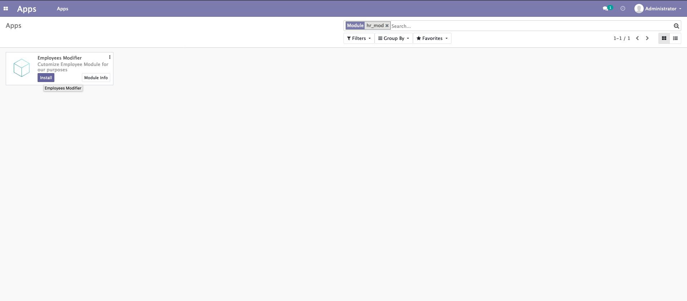


Step 5. Activate developer mode by going to general settings 

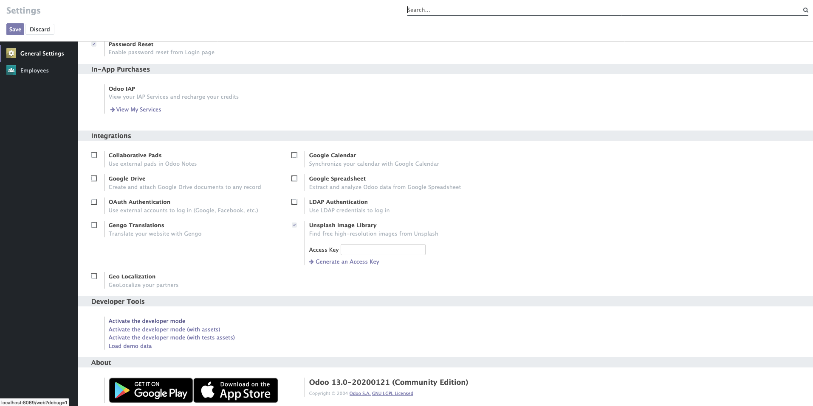

You should now be ready to develop modules

To take down Odoo completely, i.e. restart from scratch 

```sh
# ctrl + C first if you are in the same shell 
$ docker-compose down
```

To stop Odoo and continue where you left off later

```sh
# or ctrl + C if you are in the same shell
$ docker-compose stop
```

#### Loading Data 

You can optionally load in organizational data from GEDS. Please note these data sets were developed using the GEDS Open Data Set. No protected or classified information is contained within these data sets. No protected or classified information should be added to these data sets. If you are interested in how these datasets were created, vist this [repo](https://github.com/gcdevops/HRWhiteListing-data).

Step 1. Ensure you have developer mode activated 

Step 2. Navigate to the ```Employees``` (HR) module by selecting the four squares in the top left corner and clicking Employees. Then click on ```Departments``` as shown

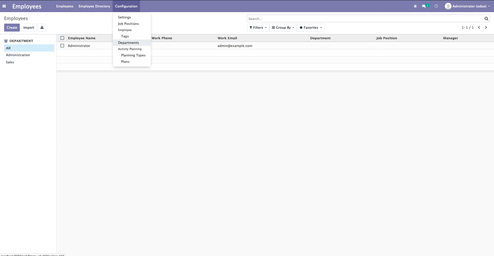

Step 3. Delete any existing data that's there

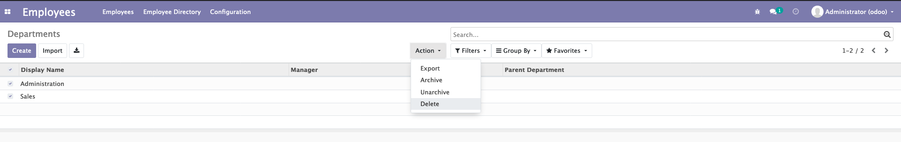

Step 4. Select import and navigate to the department import page and then select ```Load File```
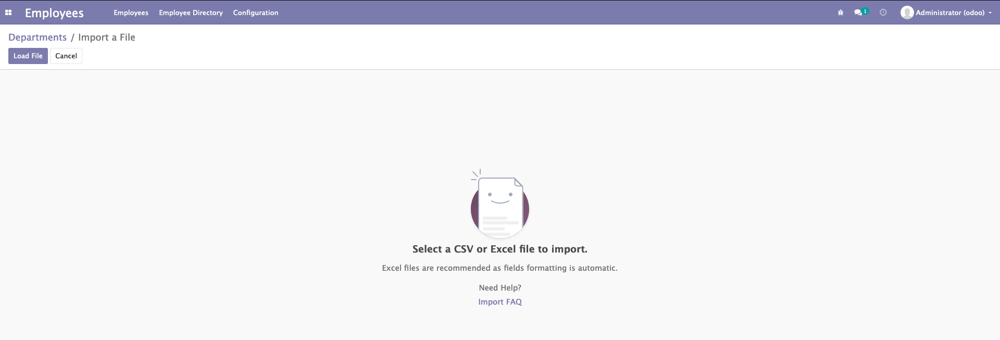 

Step 5. Select [odoo-org-csv.csv](./data/org_structure/odoo-org-csv.csv) and import

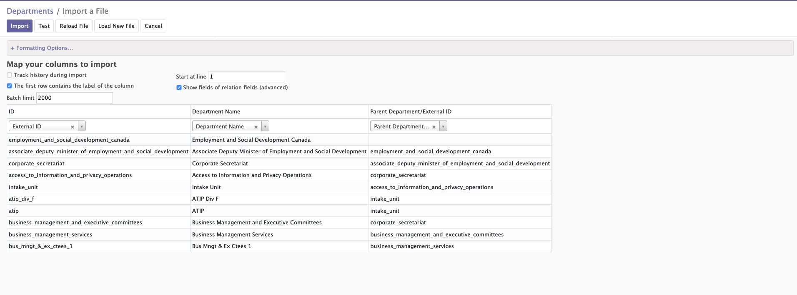

Step 6. Be patient ! This might take 5-10 minutes depending on your system

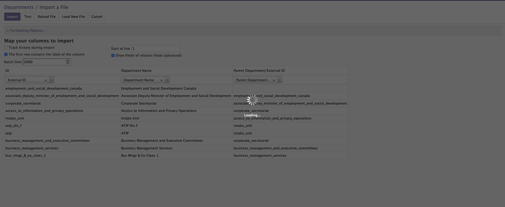

Once the loading screen stops. You should see the ESDC org structure has been imported 

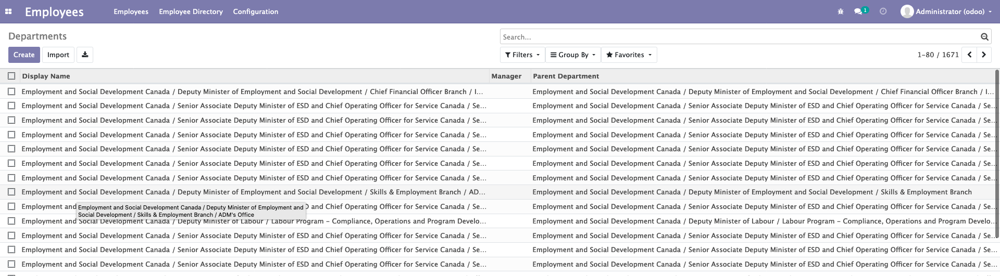
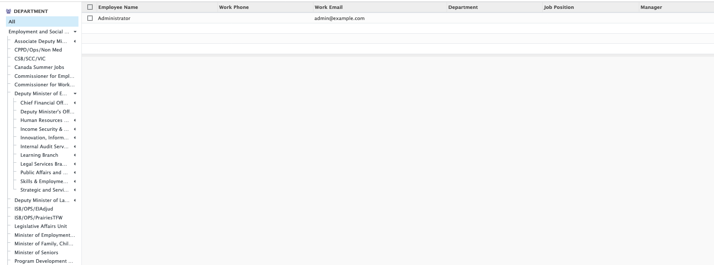

Step 7. Now you will need to load Job Titles. This is the same process as Departments except you navigate to ```Job Positions```

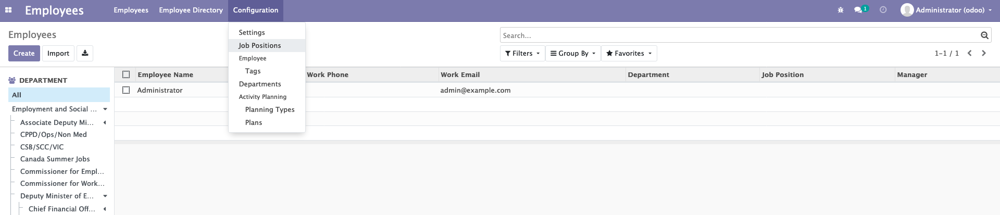

Step 8. Similarly, import [odoo-jobs-csv.csv](./data/org_structure/odoo-jobs-csv.csv)

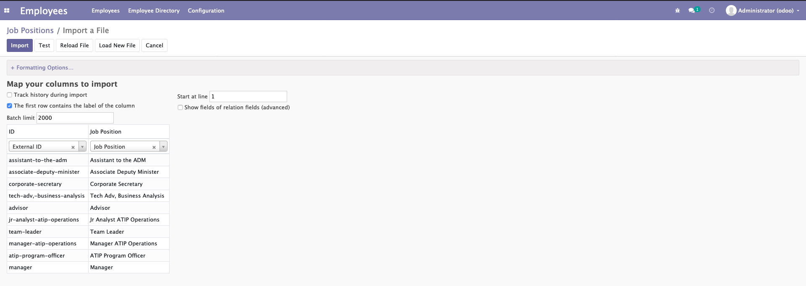

Step 9. And then same thing for Skills

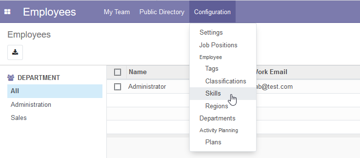

Step 10. By importing [odoo-skills-csv.csv](./data/org_structure/odoo-skills-csv.csv)

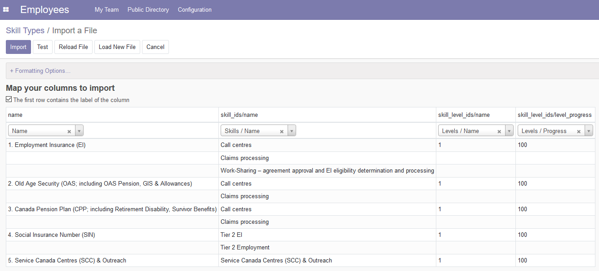

Step 11. Now import employees by navigating to the ```Employees``` page and then importing [odoo-employees-csv.csv](./data/org_structure/odoo-employees-csv.csv). Note this will take 15-20 minutes due to the large amount of records.

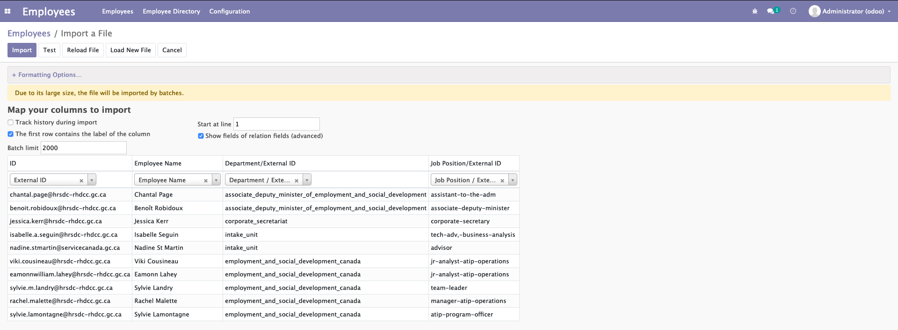
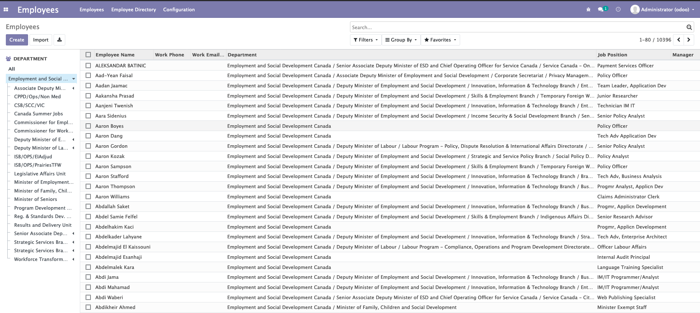

You should now have the GEDS DataSet for the ESDC Organization imported 

#### Reloading changes 

Step 1. Make sure your code is saved to disk

Step 2. Within the Apps module, update app list from Odoo ( activate developer mode if you do not see this )

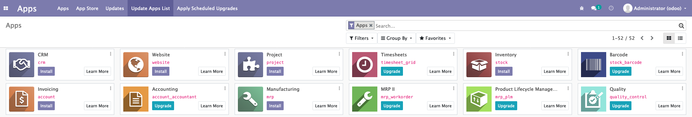

Step 5. Find your module and upgrade it 


Your changes should now be reflected


Note that if you make changes to ```python``` files, you will need to restart the server. To do this simply ```stop``` the containers by either ctrl + C if you are in the same shell, or docker-compose stop. Then start the containers back up again and upgrade your module with the altered code. 

## Creating Modules 

As stated, almost all Odoo configuration is done through modules. In this way Odoo can almost be infinitely extended. 


To get started learning how to build modules, go through this [tutorial](https://www.odoo.com/documentation/13.0/howtos/backend.html). Note: There is already an open academy module for you to play around with. Be sure to create a new branch id you decide to modify for learning purposes


### Some Notes That May Help You

A couple of things to note that aren't explicitly mentioned in the tutorial. When creating data files in XML, you are actually creating records for different tables in the database.

For example take a look at [openacademy.xml](./add-ons/openacademy/views/openacademy.xml) and specifically at this piece 

```xml
<!--course list view-->
<record model="ir.ui.view" id="course_tree_view">
    <field name="name">course.tree</field>
    <field name="model">openacademy.course</field>
    <field name="arch" type="xml">
        <tree string="Course Tree">
            <field name = "name" />
            <field name = "responsible_id" />
        </tree>
    </field>
</record>
```

It's pretty intuitive, we are creating a record for the ```ir.ui.view``` table ( ir_ui_view in PostgreSQL ) and populating the record with its fields. In this case we are creating a list view for courses based off of the openacademy.course model ( go through the tutorial at least once to understand what I am talking about).


As such you are able to use modules to overwrite data for other modules!

For example, we are using the employees module in Odoo. However, we found it was very clutered with a lot of unnecessary views. For example the kanban views for Departments and Employees. Our users are more familiar with an excel like interface, so we want to remove this view.

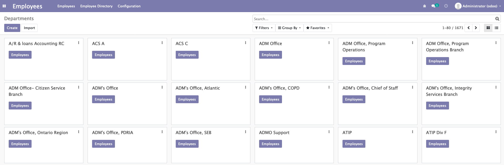

Here is the [code](https://github.com/gcdevops/odoo/tree/13.0/addons/hr) for the entire employees module on github. 

The view for departments is represented by the [hr_departments_views.xml](https://github.com/gcdevops/odoo/blob/13.0/addons/hr/views/hr_department_views.xml)

This view defines three views. To see the full code, look at hr_departments_views.xml linked above 

The kanban view 

```xml
<record id="hr_department_view_kanban" model="ir.ui.view" >
    <field name="name">hr.department.kanban</field>
    <field name="model">hr.department</field>
    <field name="arch" type="xml">
        ...
    </field>
</record>
```

The tree view 

```xml
<record id="view_department_tree" model="ir.ui.view">
    <field name="name">hr.department.tree</field>
    <field name="model">hr.department</field>
    <field name="arch" type="xml">
        <tree string="Companies">
            <field name="display_name"/>
            <field name="company_id" groups="base.group_multi_company"/>
            <field name="manager_id"/>
            <field name="parent_id"/>
        </tree>
    </field>
</record>
```


The form view 

```xml
<record id="view_department_form" model="ir.ui.view">
    <field name="name">hr.department.form</field>
    <field name="model">hr.department</field>
    <field name="arch" type="xml">
        <form string="department">
            <sheet>
                <widget name="web_ribbon" title="Archived" bg_color="bg-danger" attrs="{'invisible': [('active', '=', True)]}"/>
                <field name="active" invisible="1"/>
                <group col="4">
                    <field name="name"/>
                    <field name="manager_id"/>
                    <field name="parent_id"/>
                    <field name="company_id" options="{'no_create': True}" groups="base.group_multi_company"/>
                </group>
            </sheet>
            <div class="oe_chatter">
                <field name="message_follower_ids" widget="mail_followers" groups="base.group_user"/>
                <field name="message_ids" widget="mail_thread"/>
            </div>
        </form>
    </field>
</record>
```

These views all get combined in a window which defines the Department page in the employees module 

```xml
<record id="open_module_tree_department" model="ir.actions.act_window">
        <field name="name">Departments</field>
        <field name="res_model">hr.department</field>
        <field name="view_mode">kanban,tree,form</field>
        <field name="search_view_id" ref="view_department_filter"/>
        <field name="help" type="html">
            <p class="o_view_nocontent_smiling_face">
            Create a new department
            </p><p>
            Odoo's department structure is used to manage all documents
            related to employees by departments: expenses, timesheets,
            leaves, recruitments, etc.
            </p>
        </field>
    </record>
</data>
```

The ```view_mode``` field is specifically what enables or disables certain views. As you can see we need to remove the kanban view from our view_mode


``` xml
<field name="view_mode">kanban,tree,form</field>
```

The way this works is that the xml will be parsed by Odoo and the kanban view will be resolved to the record ```hr_department_view_kanban```. We can reference this record globally ( from other modules )by using something called the ```External ID```. This is in the format of ```<module_name>.<record_id>```, so for our kanban view it would be ```hr.hr_department_view_kanban``` for example.

In order to modify the departments page to remove the kanban view we created a new module ```hr_modifier``` that overrides the ```open_module_tree_department``` window record. You can see the file [here](./add-ons/views/hr_department_views.xml).

```xml
<?xml version="1.0" encoding="utf-8"?>
<odoo>
    <data>
      <record id="hr.open_module_tree_department" model="ir.actions.act_window">
          <field name="name">Departments</field>
          <field name="res_model">hr.department</field>
          <field name="view_mode">tree,form</field>
          <field name="search_view_id" ref="hr.view_department_filter"/>
          <field name="view_ids" eval="[(5, 0, 0), (0, 0, {'view_mode': 'tree', 'view_id': ref('hr.view_department_tree')}), (0, 0, {'view_mode': 'form', 'view_id': ref('hr.view_department_form')})]"/>
          <field name="help" type="html">
            <p class="o_view_nocontent_smiling_face">
              Create a new department
            </p><p>
              Odoo's department structure is used to manage all documents
              related to employees by departments: expenses, timesheets,
              leaves, recruitments, etc.
            </p>
          </field>
      </record>
    </data>
</odoo>
```

Take a close look at the id for this record 

```xml
<record id="hr.open_module_tree_department" model="ir.actions.act_window">
```

We are using the ```External ID``` for the Department window view. When the hr_modifier module is installed it will overwrite that window record in the database and thus removing the ability to select the kanban view ! 


