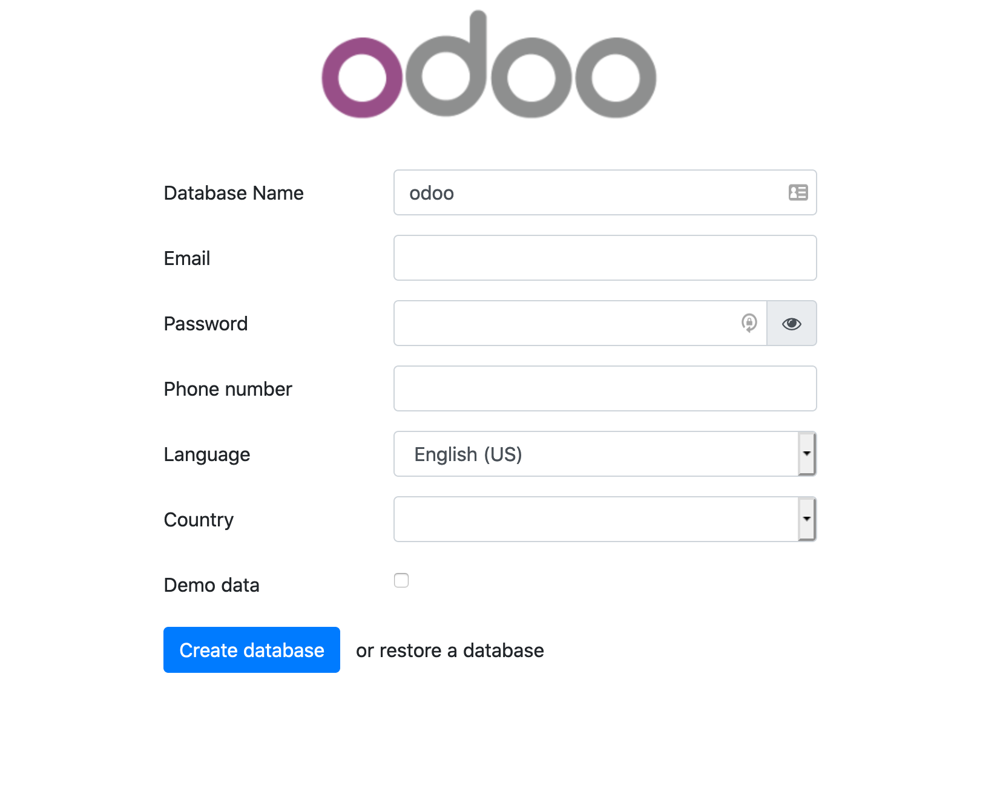
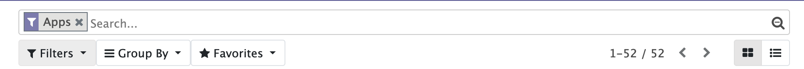
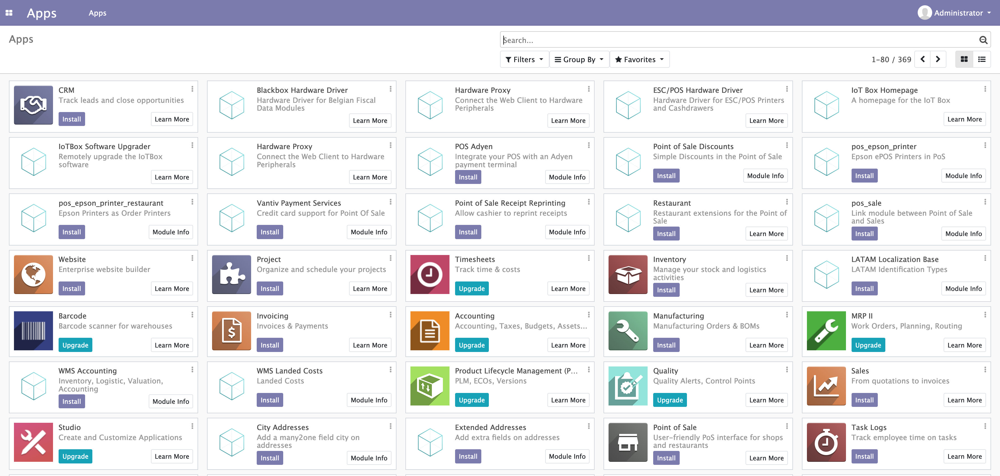

# Odoo Docker

This repo contains the nessecary Dockerfiles needed for Odoo. Our chosen solution for the [HRWhitelisting Project](https://github.com/gcdevops/HRWhiteListing). 


## What is Odoo

Odoo is an open source web-based ERP (Enterprise Resource System) built primarly on the Python programming language and PostgreSQL database. Odoo is highly cuhstomizable and configurable through its interface or through the use of modules. You can find more information on Odoo [here](https://www.odoo.com/).


## How to get Odoo running locally

We are using Docker and docker-compose for the core system and mounting custom plugins by copying them from the [add-ons](./add-ons) and [themes](./themes) to the appropriate folders within the containers. 

We have two images in this repo 

<table>
    <thead>
        <tr>
            <td>
                Dockerfile
            </td>
            <td>
                Docker Compose file
            </td>
            <td>
                Link to original image 
            </td>
            <td>
                Purpose
            </td>
        </tr>
    </thead>
    <tbody>
        <tr>
            <td>
                <a href="./OdooStock-Dockerfile">Odoo Stock Image</a>
            </td>
            <td>
                <a href="./docker-compose.yml"> Odoo Stock Compose File </a>
            </td>
            <td>
                <a href="https://hub.docker.com/_/odoo">DockerHub</a>
                <a href="https://github.com/odoo/docker/tree/6d92142da193f60c161f97eea1079f437dd51d7e/13.0">GitHub</a>
            </td> 
            <td>
                This is used for development purposes only. It is much quicker to build and start the application then the bitnami production image
            </td>   
        </tr>
        <tr>
            <td>
                <a href="./Dockerfile">Bitnami Odoo Image</a>
            </td>
            <td>
                <a href = "./prod-docker-compose.yml">Bitnami Compose File</a>
            </td>
            <td>
                <a href="https://hub.docker.com/r/bitnami/odoo/">Dockerhub</a>
                <a href="https://github.com/bitnami/bitnami-docker-odoo/tree/master/13/debian-10"> GitHub </a>
            </td>
            <td>
                This is used in the production environment as the bitnami image has better support for kubernetes. 
            </td>
        </tr>
    </tbody>
</table>


### To get the Odoo Stock Image Running


```sh
$ docker-compose up --build
```

Once you run this command, navigate to http://localhost:8069. You will then need to create a database. 




The Database Name field will be the name of the database created in PostgreSQL. The email and password fields will be the credentials to your admin account. Note that you do not need to enter an actual email. Once you are done odoo will initialize the database and you will be logged in to the application. You can then install the module you are working on. Note to find your module through seach, be sure to remove the app filter.

Remove Apps Filter



Odoo Apps Page



Unfortunately if you are using this container to develop modules and you update or change a module you will have to completely destroy the containers and rebuild.


```sh
$ docker-compose down -v
$ docker-compose up --build
```

### To get the Bitnami Production Image up and running 

```sh
$ docker-compose -f prod-docker-compose.yml up --build
```

It will take sometime to spin up and the application will be unavailable in the meantime. Once the application is set up, it will be available at http://localhost:8069.

You can log in with the credentials found in the [compose file](./prod-docker-compose.yml). 


## Creating Modules 

As stated, almost all odoo configuration is done through modules. In this way Odoo can almost be infinitely extended. 


To get started learning how to build modules, go through this [tutorial](https://www.odoo.com/documentation/13.0/howtos/backend.html). Note: There is already an open academy module for you to play around with. Be sure to create a new branch id you decide to modify for learning purposes


### Some Notes That May Help You

A couple of things to note that aren't explicitly mentioned in the tutorial. When creating data files in XML, you are actually creating records for different tables in the database.

For example take a look at [openacademy.xml](./add-ons/openacademy/views/openacademy.xml) and specifically at this piece 

```xml
<!--course list view-->
<record model="ir.ui.view" id="course_tree_view">
    <field name="name">course.tree</field>
    <field name="model">openacademy.course</field>
    <field name="arch" type="xml">
        <tree string="Course Tree">
            <field name = "name" />
            <field name = "responsible_id" />
        </tree>
    </field>
</record>
```

It's pretty intuitive, we are creating a record for the ```ir.ui.view``` table ( ir_ui_view in PostgreSQL ) and populating the record with its fields. In this case we are creating a list view for our 


